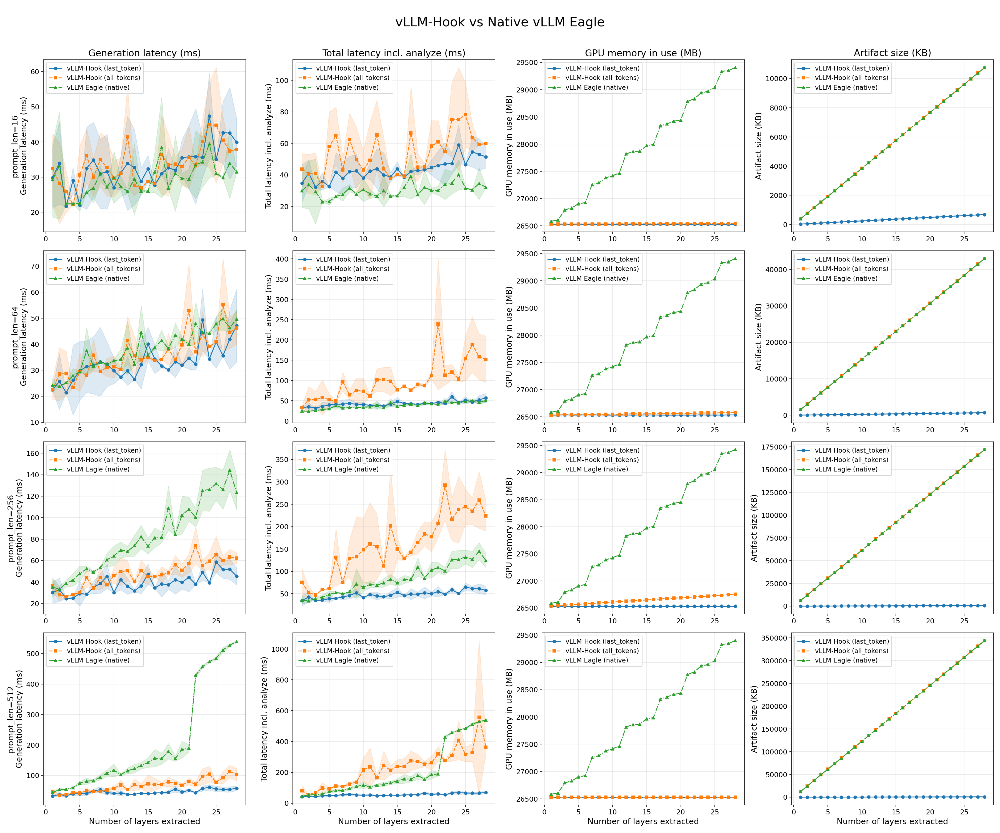

# vLLM Hidden State Extraction

## Overview

This report benchmarks **vLLM-Hook** vs. **Native vLLM Eagle** (`ExampleHiddenStatesConnector`) for hidden state extraction. Both systems extract intermediate transformer hidden states during inference that would enable supports for activation steering, probing classifiers, etc.

Native vLLM Eagle ref: https://docs.vllm.ai/en/latest/examples/offline_inference/extract_hidden_states/

---

## What Have We Compared

- **Number of layers:** 1 to all
- **Length of prompts:** around 16, 64, 256, 512 tokens
- **Extraction modes:**
    | System | Token Mode | Description |
    |--------|-----------|-------------|
    | vLLM-Hook | `last_token` | Extracts the last-token hidden state per prompt per layer |
    | vLLM-Hook | `all_tokens` | Extracts hidden states for all tokens per prompt per layer |
    | Native vLLM Eagle | N/A (effectively `all_token`) | Built-in extraction via `ExampleHiddenStatesConnector` |

---

## Key Findings



*Four metrics across 4 prompt lengths (rows) and 28 layer counts (x-axis). Shaded bands show ± standard deviation over 10 runs.*


### 1. At low layer counts, all three systems perform comparably

When extracting hidden states from only a few layers (~1–4), all three systems show similar generation latency regardless of prompt length. For example, at 1 layer, vLLM-Hook (`last_token`) = 29.8 ms, vLLM-Hook (`all_tokens`) = 32.4 ms, and native vLLM Eagle = 29.2 ms (16-token prompt).

### 2. vLLM-Hook (`last_token`) has the lowest and flattest latency overhead

vLLM-Hook (`last_token`) adds only **1.3–2.1×** overhead from 1 to 28 layers, independent of prompt length. At 512 tokens and 28 layers it takes **58.4 ms** — compared to **103.5 ms** for vLLM-Hook (`all_tokens`) and **539.2 ms** for native Eagle. This makes it the best choice when only the final-position representation is needed. For example, when one needs hidden states from all layers, we have

| Prompt length | vLLM-Hook (`last_token`) | vLLM-Hook (`all_tokens`) | native vLLM Eagle |
|:---:|:---:|:---:|:---:|
| 16 tokens | 39.9 ms | 37.9 ms | 31.5 ms |
| 64 tokens | 47.1 ms | 46.3 ms | 49.7 ms |
| 256 tokens | 45.6 ms | 62.3 ms | 123.4 ms |
| 512 tokens | 58.4 ms | 103.5 ms | 539.2 ms |

vLLM-Hook (`last_token`) slices to the last token at capture time inside the worker, so only a single `(hidden_size,)` vector per layer is written to disk, regardless of prompt length. Native vLLM and stores all prompt tokens and all layers together.

### 3. Artifact size for last_token is prompt-length invariant

vLLM-Hook (`last_token`) produces a flat **677 KB** artifact regardless of prompt length, since it stores only one vector per prompt per layer. This is up to ~510× smaller than `all_tokens` or native Eagle at long sequences (~344 MB at 28 layers / 512 tokens), making it suitable for high-throughput scenarios where storage or I/O bandwidth is a bottleneck.

### 4. Native vLLM Eagle carries a ~2.3 GiB GPU memory overhead

Native vLLM `ExampleHiddenStatesConnector` is built on Eagle-3 speculative decoding infrastructure, which requires loading a dummy drafter model. In practice this reduces the available KV cache by ~2.3 GiB (vLLM-Hook: 18.45 GiB available; native: 16.13 GiB available).


---

## Reproduction
**Model:** Qwen2-1.5B-Instruct  
**Hardware:** Single GPU (A100/H100 class, ~74 GB VRAM)  
**Environment:**
- vLLM 0.18.0, PyTorch 2.10.0+cu129
- `VLLM_USE_V1=1` (v1 engine)
- `VLLM_WORKER_MULTIPROC_METHOD=spawn`
- `VLLM_USE_AOT_COMPILE=0` (required workaround: PyTorch 2.10.0 does not support `aot_compile` as called by vLLM 0.18.0's compilation pipeline)

```bash
# Install dependencies
pip install -r requirement.txt
pip install -e vllm_hook_plugins

# Run the comparisons
rm -rf /dev/shm/vllm_hook
python docs/numerical_analysis/benchmark_hidden_states.py \
    --sweep-grid \
    --hook-dir /dev/shm/vllm_hook \
    --variant-last-token disk-st-async \
    --variant-all-tokens disk-st-async \
    --output docs/numerical_analysis/grid_results.csv

# Generate plots
python docs/numerical_analysis/plot_grid_results.py \
    --input docs/numerical_analysis/grid_results.csv \
    --output-dir docs/numerical_analysis/plots/
```

---

## Artifact Verification

To verify that vLLM-Hook (`all_tokens`) produces the same hidden states as Native vLLM Eagle:

```bash
python docs/numerical_analysis/verify_artifact_parity.py
```
This runs both systems on the same 8 prompts, extracts all 20 layers, and compares tensors token-by-token. vLLM-Hook (`all_tokens`) mode was verified to produce numerically equivalent hidden states to Native vLLM Eagle (cosine similarity ∈ [0.999998, 1.000072] across all 160 layer×prompt tensors, max absolute diff = 0.0 — i.e., bitwise identical at float16).

