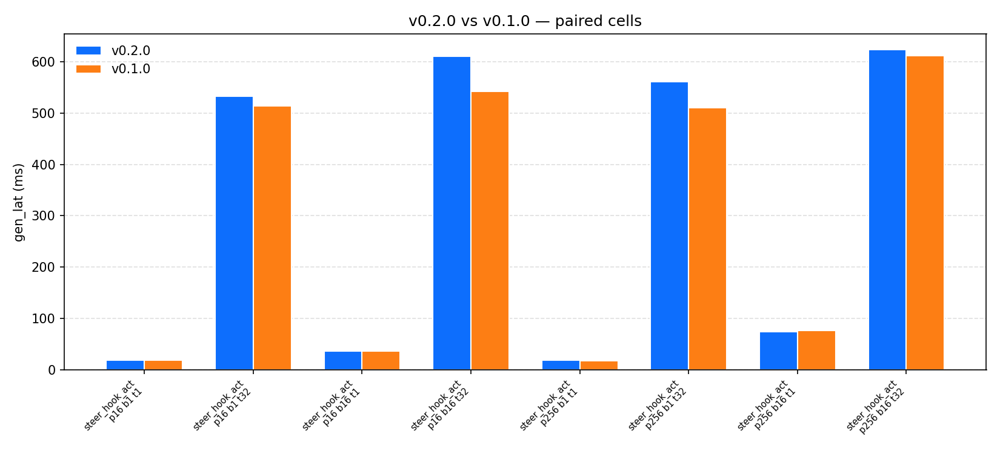

<!--
profiling/REPORT_TEMPLATE.md
============================
Paper-grade report scaffold. After running `bash profiling/runners/submit_all.sh`
on the cluster, this template's plots auto-fill from `profiling/results/plots/`
(generated by `python profiling/analyze/plot_results.py`). All you have to do
is fill the analysis prose in the "Analysis" blocks below.

The report is structured to map 1-to-1 with the figures the script produces:

   §3.1  →  01_r0_r5_latency.png
   §3.2  →  02_memory_footprint.png
   §3.3  →  03_storage_matrix.png
   §3.4  →  04_idle_tax.png
   §3.5  →  05_serve_throughput.png
   §3.6  →  06_stage_breakdown.png
   §3.7  →  07_v020_vs_v010.png  (only if INCLUDE_V010=1 was set)

Delete this comment block before sharing the report.
-->

# vLLM-Hook Performance Report

**Model**: <!-- e.g. Qwen/Qwen2-1.5B-Instruct -->
**Hardware**: <!-- e.g. NVIDIA A100 80 GB, GPFS storage -->
**vLLM version**: <!-- e.g. 0.21.0 -->
**Plugin version**: <!-- e.g. 0.2.0 -->
**Run ID(s)**: <!-- list the LSF job IDs of smoke / quick / idle / storage / serve -->
**Date**: <!-- YYYY-MM-DD -->

---

## 1. Abstract

<!--
2–4 sentences. What is vLLM-Hook? What did we measure? What's the single
biggest finding? Example:

> vLLM-Hook is a plug-in for vLLM that lets users passively capture or actively
> modify internal model states. We profiled five hook configurations (R0–R5)
> across latency, memory, storage, idle-tax, and serve-path concurrency axes.
> The plug-in adds <5 % overhead when loaded but idle (R0 → R1), <20 % for
> light probes (R2/R3/R5), and up to +60 % for the heaviest case
> (R4: probe_hidden_states, all_tokens, all layers). Serve-path throughput
> collapses under concurrency because of synchronous JSON serialization in
> the response path — the dominant remaining bottleneck.
-->

---

## 2. Methodology

### 2.1 What the tool measures

Five categories of metrics, each captured for every cell:

| Axis | Examples | Source |
|---|---|---|
| End-to-end latency | `gen_lat_mean`, `analyze_lat_mean` | `time.perf_counter` around driver calls |
| Throughput | `prefill_tok_per_sec`, `decode_tok_per_sec`, serve `req_per_sec` | tokens divided by elapsed wall time |
| Per-stage breakdown | `timer.hookllm.generate`, `timer.worker.cpu_transfer.hs`, … (≈ 15 timers, 9 stats each) | `PROF.timed(...)` wraps; driver + worker |
| Memory | `gauge.mem.cuda_alloc_mb.max` (worker, 50 ms NVML sampler), `host_rss_mb_max`, `peak_gpu_mb` (NVML) | torch caching allocator + NVML + psutil |
| I/O artifact | `artifact_kb_mean`, sidecar bytes | filesystem |

### 2.2 The five rows (R0–R5)

| # | row label | Hook installed | Hook fires? | Question answered |
|---|---|---|---|---|
| R0 | `baseline` | no | — | Unhooked vLLM ceiling |
| R1 | `plugin_idle` | imported, no worker_extension | — | Import tax |
| R2 | `probe_hook_qk:last_token` | QK | only last token | Minimal QK capture |
| R3 | `probe_hook_qk:all_tokens` | QK | every token | Full QK capture |
| R4 | `probe_hidden_states` | HS | all tokens, all 28 layers | Maximum-bandwidth case |
| R5 | `steer_hook_act` | steering | yes, in-place | Minimal-egress intervention |

### 2.3 How to reproduce

```bash
git clone <repo> && cd vLLM-Hook
pip install -e vllm_hook_plugins
bash profiling/runners/submit_all.sh                         # smoke + quick + idle + storage + serve
# optional: pair with v0.1.0 peer rows in plan-quick
INCLUDE_V010=1 bash profiling/runners/submit_all.sh
# After all jobs finish:
python profiling/analyze/plot_results.py                     # generates plots/
python profiling/analyze/summarize.py profiling/results/quick-*.csv \
       --output profiling/results/quick-summary.md
```

---

## 3. Results

### 3.1 Generation latency across rows (the headline)


Eight workload cells per row: `(prompt_len, batch_size, max_tokens)` ∈
`{16, 256}` × `{1, 16}` × `{1, 32}`. The reader can compare any of the six
rows against R0 at the same workload.

**Headline numbers** (mean across cells, taken from `quick-*-summary.md`):

| # | row | gen_lat_ms | vs baseline | decode_tok/s | artifact/cell |
|---|---|---:|---:|---:|---:|
| R0 | baseline | <!-- fill --> | — | <!-- --> | 0 |
| R1 | plugin_idle | <!-- --> | <!-- +X% --> | <!-- --> | 0 |
| R2 | probe_hook_qk:last_token | <!-- --> | <!-- --> | <!-- --> | <!-- KB --> |
| R3 | probe_hook_qk:all_tokens | <!-- --> | <!-- --> | <!-- --> | <!-- KB --> |
| R4 | probe_hidden_states | <!-- --> | <!-- --> | <!-- --> | <!-- KB --> |
| R5 | steer_hook_act | <!-- --> | <!-- --> | <!-- --> | 0 |

<!-- Analysis: 2–4 sentences. Examples to consider:
  - Which row is "essentially free" and why?
  - Which row is the most expensive and at what workload?
  - Does the workload axis change the ranking?
-->

### 3.2 Memory footprint per row


Left panel: torch caching allocator peak (`cuda_alloc_mb`) + driver process
RSS (`host_rss_mb`), sampled inside the worker process at 50 ms cadence.
Right panel: system-wide NVML peak — effectively constant because the KV
cache dominates.

| row | worker cuda_alloc_mb | worker host_rss_mb | NVML peak (mb) |
|---|---:|---:|---:|
| baseline | <!-- --> | <!-- --> | <!-- --> |
| plugin_idle | <!-- --> | <!-- --> | <!-- --> |
| probe_hook_qk:all_tokens | <!-- --> | <!-- --> | <!-- --> |
| probe_hidden_states | <!-- --> | <!-- --> | <!-- --> |
| steer_hook_act | <!-- --> | <!-- --> | <!-- --> |

<!-- Analysis: NVML is system-wide and dominated by the KV cache, so the
     informative number is `worker cuda_alloc_mb`. Which hook adds the
     most allocator pressure? Is the spike persistent (peak ≈ steady-state)
     or transient (peak >> steady-state)?
-->

### 3.3 Storage variant matrix — `probe_hidden_states`


Six storage variants × two modes × four prompt lengths. The colour scale is
`gen_lat (ms)` — green = fast, red = slow. The reader can see, at a glance,
which (variant, mode) combination minimises latency at each prompt length.

| variant | last_token best at | all_tokens best at |
|---|---|---|
| rpc | <!-- prompt lens where it wins --> | <!-- --> |
| disk-pt | <!-- --> | <!-- --> |
| disk-pt-async | <!-- --> | <!-- --> |
| disk-st | <!-- --> | <!-- --> |
| disk-st-async | <!-- --> | <!-- --> |
| shm | <!-- last_token only --> | n/a |

<!-- Analysis: Which storage variant wins across the matrix? At which
     prompt length does the ranking change (if any)? Recommended default?
-->

### 3.4 Idle plugin tax (CUDA-graph budget gate)


Dashed red line = the 5 % pass gate from `cuda_graph_plan.html`. Two bars
per batch size: the plug-in loaded but no hooks installed (blue) and the
hooks installed but every request opts out (orange).

| bs | plugin_overhead_pct | hooks_overhead_pct | verdict |
|---:|---:|---:|---|
| 1 | <!-- --> | <!-- --> | <!-- PASS / FAIL --> |
| 8 | <!-- --> | <!-- --> | <!-- --> |
| 64 | <!-- --> | <!-- --> | <!-- --> |

<!-- Analysis: Did every batch size pass the 5 % gate? If not, which one
     failed and by how much? Does this justify the CUDA-graph re-enablement
     work? -->

### 3.5 Serve-path throughput (asyncio jam reproducer)


Closed-loop driver, k ∈ {1, 2, 4, 8} concurrent OpenAI-compatible clients,
30 s window per cell. Left panel: throughput (higher is better). Right
panel: tail latency (lower is better).

| worker | req/s @ k=1 | req/s @ k=8 | gen_lat p99 @ k=1 | gen_lat p99 @ k=8 |
|---|---:|---:|---:|---:|
| baseline | <!-- --> | <!-- --> | <!-- ms --> | <!-- ms --> |
| qk | <!-- --> | <!-- --> | <!-- --> | <!-- --> |
| hidden_states | <!-- --> | <!-- --> | <!-- --> | <!-- --> |

<!-- Analysis: At k=8, baseline scales linearly while hook rows plateau.
     What's the multiplicative gap? Does the response_bytes column (in
     serve-*.csv) explain it? Quote the bytes/req figure that justifies
     the asyncio-jam diagnosis. -->

### 3.6 Per-stage breakdown — where does time go?


Stacked bars showing how long each profiled stage took, summed for the
worst-case workload cell per row. Useful for spotting which stage
dominates each row's cost.

| dominant stage | row | mean time (ms) |
|---|---|---:|
| `hookllm.generate` (driver) | <!-- which row? --> | <!-- --> |
| `analyzer.kernel` (driver) | <!-- --> | <!-- --> |
| `worker.disk_write.safetensors` (worker) | <!-- --> | <!-- --> |
| `worker.cpu_transfer.hs` (worker) | <!-- --> | <!-- --> |

<!-- Analysis: For the most expensive row (R4), is the cost in generate,
     analyze, or post-pass I/O? What does that suggest for optimisation
     priority? -->

### 3.7 v0.2.0 vs v0.1.0 (optional, only if INCLUDE_V010=1)



Paired bars: same workload cell, same hook, but one bar runs through the
current v0.2.0 plug-in and the other runs through the v0.1.0 code we
vendored under `profiling/peers/v010/`. The interesting number is the
**relative gap**, not the absolute value.

<!-- Analysis: Did v0.2.0 win across the board? Which cells did v0.1.0
     edge out, and why (likely prefix-cache differences or the file-flag
     control plane overhead)? -->

---

## 4. Discussion

### 4.1 What the data supports

<!-- 3–6 bullets, each a claim the data backs up, with a pointer to the
     supporting figure. Examples:
  - Loading the plug-in is free (R0 vs R1: <5 % at every workload — §3.1).
  - Probe-hidden-states is the dominant-cost hook (R4 at largest workload
    is +Y % vs baseline — §3.1, §3.2).
  - disk-st-async is the right default for HS (§3.3).
  - Serve-path throughput collapses under concurrency because of the
    JSON-encode step (§3.5; supported by the byte-size column).
-->

### 4.2 Threats to validity

<!-- Honest list. Examples:
  - All measurements on one model (Qwen2-1.5B). Larger models may shift
    relative costs.
  - prompt_len capped at 256 (quick) / 512 (storage). Behavior at 4 k+ tokens
    not directly measured.
  - n_layers held constant at "all". Numerical_Analysis showed cost scales
    sub-linearly with layer count, so partial-layer captures should be cheaper
    in proportion.
  - Eager mode (enforce_eager=True) everywhere. CUDA-graph re-enablement
    would change the absolute numbers but should preserve relative ordering.
-->

### 4.3 Recommendations

<!-- 2–4 short, actionable items the rest of the team / community should
     act on, based on the data. Examples:
  - Set disk-st-async as the default storage variant for hidden-states
    capture in `vllm_hook_plugins/configs.md`.
  - Treat probe_hidden_states + all_tokens as the worst-case workload in
    any future regression suite — every change should be measured against
    cell (prompt_len=256, batch=16, max_tokens=32) at minimum.
  - Prioritise the binary-wire serialisation patch (plan.html §7) — the
    serve-path data (§3.5) shows it's the dominant remaining bottleneck.
-->

---

## 5. Reproducing the report

```bash
# 1. Submit everything.
bash profiling/runners/submit_all.sh

# 2. Wait for jobs to finish.
bjobs   # all four post-smoke stages should reach DONE within ~2.5 h

# 3. Regenerate plots.
python profiling/analyze/plot_results.py

# 4. Regenerate the summaries.
python profiling/analyze/summarize.py profiling/results/quick-*.csv \
       --output profiling/results/quick-summary.md
python profiling/analyze/summarize.py profiling/results/storage-*.csv \
       --output profiling/results/storage-summary.md

# 5. (Optional, if INCLUDE_V010=1 was set) the summary will include a
#    "v0.2.0 vs v0.1.0" section automatically.
```

---

## 6. Raw data

All CSVs, JSONL dumps, and per-worker profile JSONs are under
`profiling/results/`. The four headline files:

```
quick-<model>-<job>.csv            48 cells, R0–R5 × 8 workloads
storage-<model>-<job>.csv          88 cells, HS × 6 variants
idle-<model>-<job>.csv             3 cells, one per batch size
serve-<model>-<job>.csv            ~12 cells, workers × concurrencies
```

Each row carries every metric described in §2.1 plus the full per-cell
context (model, dtype, tp_size, prompt_len, batch_size, max_tokens,
storage_variant, mode, hooks_on, run_id, …).

For per-rep raw data (recompute percentiles without re-running), the
`.jsonl` companion files contain one record per cell with the full
`PROF.snapshot()` arrays.

---

*Report scaffold generated from `profiling/REPORT_TEMPLATE.md`.
Companion files: `profiling/analyze/plot_results.py`,
`profiling/analyze/summarize.py`, `claude_docs/profiling_tool.html`.*
