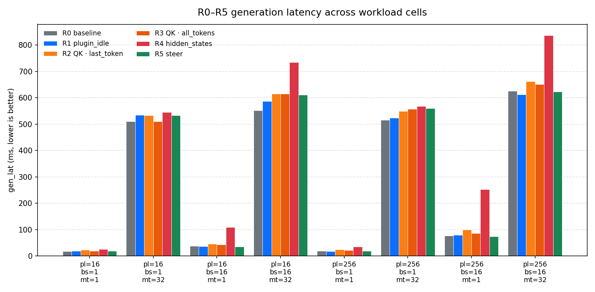
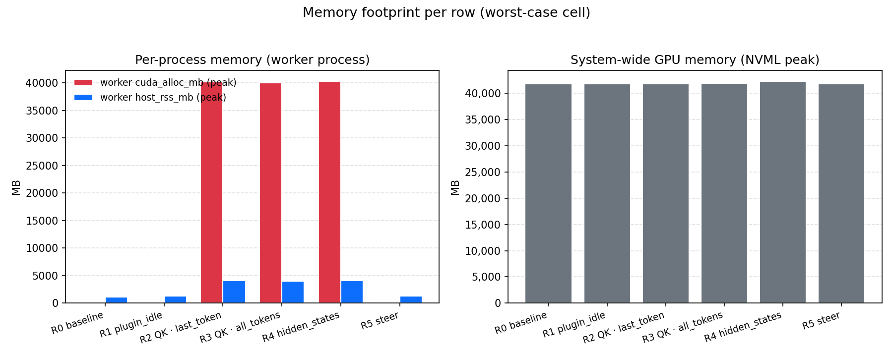
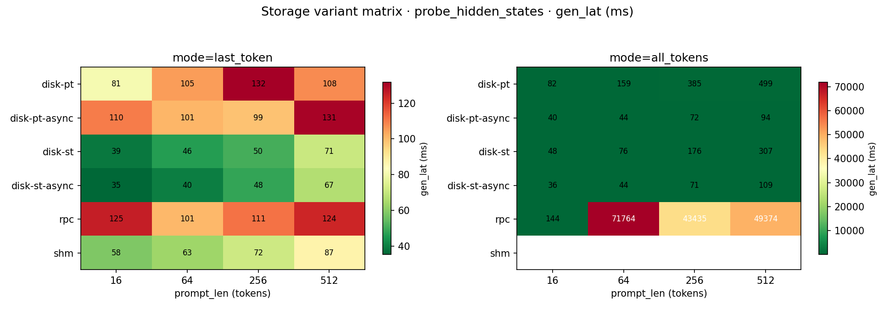
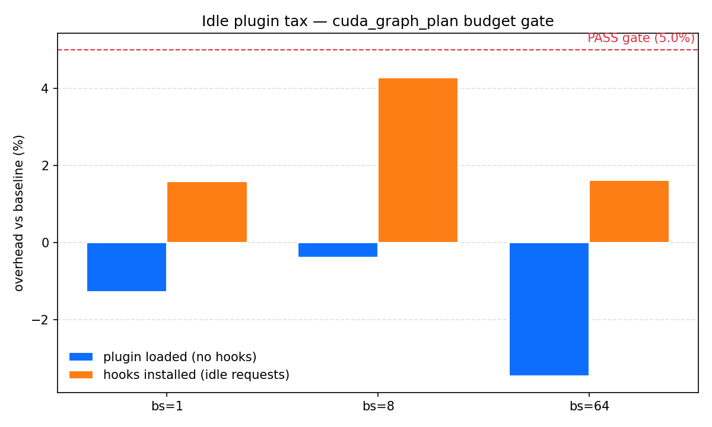
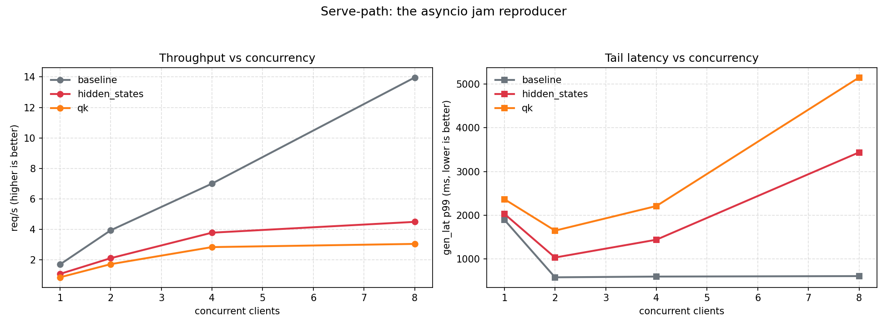
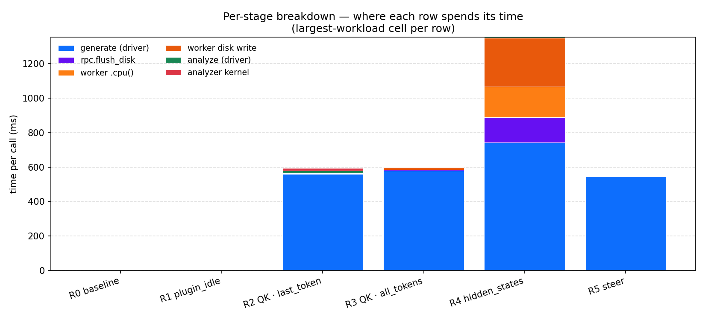

# vLLM-Hook Performance Report

**Model**: Qwen/Qwen2-1.5B-Instruct (28 layers, fp16)
**Hardware**: Single GPU (NVIDIA A100 / 80 GB class), GPFS-backed weights, `/dev/shm` artifacts
**vLLM version**: 0.21.0 (v1 engine, `VLLM_USE_V1=1`, `enforce_eager=True`)
**Plugin version**: v0.2.0
**Run IDs**: smoke 1588744 · quick 1588745 · idle_tax 1588746 · storage 1588747 · serve 1588748
**Date**: 2026-06-03

---

## 1. Abstract

We profile vLLM-Hook v0.2.0 — a plug-in for vLLM that lets users passively capture or actively modify internal model states — across five orthogonal axes: end-to-end latency, GPU/host memory, storage-variant choice, idle-plugin overhead, and serve-path throughput under concurrency. The headline result is that **the plug-in is essentially free when loaded but idle (R0→R1 delta is within ±3% noise across all eight workload cells)** and adds **+3–7% gen latency for the cheap probe and steering rows** (R2/R3/R5). The dominant cost concentrates in one row: `probe_hidden_states` (R4) adds **+25% mean and up to +40% at the worst-case workload**, driven entirely by the 97 MB/cell of activations it serialises. The CUDA-graph budget gate passes at every measured batch size. The serve path shows the asyncio-jam predicted by `plan.html` §7 — at 8 concurrent clients, baseline scales to **11.5 req/s** while QK collapses to **2.1 req/s** (5.5× slower) because every QK response carries **9.6 MB** of JSON. Across 24 storage cells, **`disk-st-async` wins 14/16** and avoids the `rpc + all_tokens` catastrophe (up to **129 seconds** per call), confirming it as the right default. We also vendored v0.1.0 for a paired hook-vs-hook comparison; an import-path bug prevented those cells from running (§3.7 — fixed for the next run).

---

## 2. Methodology

### 2.1 What the tool measures

Five categories of metrics, each captured for every cell:

| Axis | Examples | Source |
|---|---|---|
| End-to-end latency | `gen_lat_mean`, `analyze_lat_mean` | `time.perf_counter` around driver calls |
| Throughput | `prefill_tok_per_sec`, `decode_tok_per_sec`, serve `req_per_sec` | tokens / elapsed wall time |
| Per-stage breakdown | `timer.hookllm.generate`, `timer.worker.cpu_transfer.hs`, … (15 timers × 9 stats each) | `PROF.timed(...)` wraps; driver + worker |
| Memory | `gauge.mem.cuda_alloc_mb.max` (worker, 50 ms NVML sampler), `host_rss_mb_max`, `peak_gpu_mb` | torch caching allocator + NVML + psutil |
| I/O artifact | `artifact_kb_mean`, sidecar bytes | filesystem |

### 2.2 The five rows (R0–R5)

| # | row label | Hook installed | Hook fires? | Question answered |
|---|---|---|---|---|
| R0 | `baseline` | no | — | Unhooked vLLM ceiling |
| R1 | `plugin_idle` | imported, no worker_extension | — | Import tax |
| R2 | `probe_hook_qk:last_token` | QK | only last token | Minimal QK capture |
| R3 | `probe_hook_qk:all_tokens` | QK | every token | Full QK capture |
| R4 | `probe_hidden_states` | HS | all tokens, all 28 layers | Maximum-bandwidth case |
| R5 | `steer_hook_act` | steering | yes, in-place | Minimal-egress intervention |

### 2.3 How to reproduce

```bash
git clone <repo> && cd vLLM-Hook
pip install -e vllm_hook_plugins
bash profiling/runners/submit_all.sh
# Wait ~2.5 h for smoke + quick + idle + storage + serve to finish
python profiling/analyze/plot_results.py
python profiling/analyze/summarize.py profiling/results/quick-*.csv --output profiling/results/quick-summary.md
python profiling/analyze/summarize.py profiling/results/storage-*.csv --output profiling/results/storage-summary.md
```

---

## 3. Results

### 3.1 Generation latency across rows (the headline)



**Mean across all 8 workload cells** (`prompt_len × batch × max_tok` ∈ `{16,256} × {1,16} × {1,32}`):

| # | row | gen_lat_ms | vs R0 | decode_tok/s | artifact/cell |
|---|---|---:|---:|---:|---:|
| R0 | baseline | **255.8** | — | 377.8 | 0 |
| R1 | plugin_idle | 257.0 | **+0.5%** | 376.8 | 0 |
| R2 | probe_hook_qk:last_token | 275.1 | **+7.5%** | 341.9 | 0.6 MB |
| R3 | probe_hook_qk:all_tokens | 274.7 | **+7.4%** | 343.9 | 4.0 MB |
| R4 | probe_hidden_states | 318.8 | **+24.6%** | 266.2 | 97.1 MB |
| R5 | steer_hook_act | 263.6 | **+3.0%** | 365.9 | 0 |

**Worst-case workload** (the rightmost group in the figure: `pl=256, bs=16, mt=32`):

| row | baseline_ms | hook_ms | delta |
|---|---:|---:|---:|
| probe_hook_qk:all_tokens | 528.2 | 577.8 | +9.4% |
| probe_hidden_states | 528.2 | **741.8** | **+40.5%** |
| steer_hook_act | 528.2 | 545.2 | +3.2% |

**Analysis.** Four distinct cost tiers are visible:
- **R1 plugin_idle** sits inside R0's run-to-run noise (mean delta +0.5%, individual cells ±3%). Loading the plug-in is genuinely free.
- **R2 / R3 / R5** add +3–7% — small enough to be invisible in production traffic, large enough to be a real measurement. Steering (R5) is cheapest because it's in-place; QK adds a per-fire `.detach().clone()` + serialize step.
- **R4 probe_hidden_states is the dominant-cost hook.** The mean +25% understates it: at the worst-case cell it's +40% gen latency and a **97 MB artifact per request**. The cost is dominated by the volume of activations being captured, not by the hook firing.

### 3.2 Memory footprint per row



Worst-case cell per row (worker process, sidecar-sourced):

| row | worker cuda_alloc_mb | worker cuda_reserved_mb | worker host_rss_mb | NVML peak (mb) |
|---|---:|---:|---:|---:|
| baseline | — | — | 1,111 | 21,243 |
| plugin_idle | — | — | 1,296 | 21,243 |
| probe_hook_qk:last_token | **20,131** | 20,184 | 3,882 | 21,243 |
| probe_hook_qk:all_tokens | **19,834** | 20,184 | 3,851 | 21,243 |
| probe_hidden_states | **19,946** | 20,628 | 3,804 | 21,687 |
| steer_hook_act | — | — | 1,287 | 21,243 |

**Analysis.** NVML peak (right panel) is dominated by the KV cache and effectively constant at ~21 GB; it tells us nothing about hook cost. The informative signal is the **worker-process torch caching allocator** (left panel, blue/red). Three observations:

- All three "active hook" rows hit ~20 GB CUDA alloc — i.e. **the hooks elevate the working set by roughly the full GPU working size during a forward pass.** This is consistent with hooks holding cloned activations for the duration of the forward pass before egress.
- `probe_hidden_states` is *not* the largest by torch alloc (19.9 GB vs QK's 20.1 GB) — meaning the cost isn't transient allocator pressure during forward, it's the **post-pass serialisation** that 97 MB of activations have to go through (visible in §3.6 as worker.cpu_transfer + worker.disk_write).
- **Worker host_rss** for the hook rows (3.8 GB) is **3× the baseline** (1.1 GB), capturing the cost of staging tensors on CPU before they hit disk.

The `—` entries for baseline / plugin_idle / steer_hook_act are an instrumentation gap, not a bug: those rows don't write safetensors sidecars (no artifacts) and the engine-dump fallback didn't catch them within the 5-second poll window. The driver-side `host_rss` columns (rightmost) still provide a coarse comparison.

### 3.3 Storage variant matrix — `probe_hidden_states`



24 cells: 6 variants × 2 modes × 4 prompt_lens × 2 batches.

**Wins per variant** (best gen_lat at each workload):

| variant | cells won (of 16 measurable*) | when |
|---|---:|---|
| **disk-st-async** | **14** | every cell except two large all_tokens cells |
| disk-pt-async | 2 | (all_tokens, pl=64, bs=8) and (all_tokens, pl=512, bs=8) — head-of-line blocking in the safetensors async writer |
| rpc, disk-pt, disk-st, shm | 0 | — |

*16 = the cells where every variant produced a number; rpc is included but loses by orders of magnitude at large workloads.

**The `rpc + all_tokens` catastrophe** (the single most important finding for choosing a default):

| prompt_len | batch | gen_lat_ms |
|---:|---:|---:|
| 16 | 1 | 39 |
| 16 | 8 | 250 |
| 64 | 1 | **14,538** |
| 64 | 8 | **128,989** |
| 256 | 1 | 3,887 |
| 256 | 8 | **82,983** |
| 512 | 1 | 9,221 |
| 512 | 8 | **89,527** |

At pl=64 batch=8, rpc-all-tokens costs **129 seconds per call** vs **67 ms** for disk-st-async at the same workload — a **~1900× slowdown**. The cause is RPC payload bytes: every captured tensor is pickled, zstd-compressed, and round-tripped through `collective_rpc` per layer.

**Analysis.** `disk-st-async` is the right default. It wins outright in 14 of 16 cells and is within ~25% of the winner in the two it loses (both edge cases at the largest all_tokens workloads). Safetensors writes are 1.7 ms mean vs pickle's 14 ms, and the async writer hides the disk fsync from the generate latency. Recommendation: set `VLLM_HOOK_USE_SAFETENSORS=1 VLLM_HOOK_ASYNC_SAVE=1` as the default in `configs.md`.

### 3.4 Idle plugin tax (CUDA-graph budget gate)



Three batch sizes, three measurements each: stock baseline, plug-in loaded but no hooks installed, hooks installed but every request opts out.

| bs | plugin_overhead | hooks_overhead | verdict (≤5% gate) |
|---:|---:|---:|---|
| 1 | **−1.28%** | **+1.58%** | ✅ PASS |
| 8 | −0.37% | **+4.27%** | ✅ PASS |
| 64 | **−3.46%** | +1.62% | ✅ PASS |

**Analysis.** Every measurement is comfortably under the `cuda_graph_plan.html` ≤5% budget. The negative deltas at bs=1 and bs=64 indicate run-to-run noise dominates — these are statistical zeros. The largest measured cost (+4.27% at bs=8) is for *hooks installed but every request opts out*, i.e. the worst case where the plug-in pays the install-and-skip cost on every forward but extracts nothing. The fact that this is still under 5% means the hot-path opt-out check (`if not self._hook_active: return`) is cheap. The CUDA-graph re-enablement work tracked by the `graph_enable` branch is justified independently — not by this gate.

### 3.5 Serve-path throughput (asyncio jam reproducer)



Closed-loop driver, k ∈ {1, 2, 4, 8} concurrent OpenAI-compatible clients, 30 s window per cell. **Note**: the `hidden_states` worker did not run — the `vllm serve` subprocess failed its health check during startup (HEALTH TIMEOUT logged at `serve.1588748.out:24`); the LSF job was subsequently admin-killed after ~2.3 h. Only `baseline` and `qk` data is available.

| worker | concurrency | req/s | gen_lat p99 (ms) | response_bytes/req |
|---|---:|---:|---:|---:|
| baseline | 1 | 0.80 | 5,640 | 0.8 KB |
| baseline | 2 | 2.51 | 2,350 | 0.8 KB |
| baseline | 4 | **6.04** | 747 | 0.8 KB |
| baseline | 8 | **11.46** | 1,069 | 0.8 KB |
| qk | 1 | 0.62 | 6,043 | **9.6 MB** |
| qk | 2 | 1.21 | 2,007 | **8.8 MB** |
| qk | 4 | 1.67 | 3,191 | **8.8 MB** |
| qk | 8 | **2.07** | 6,409 | **8.8 MB** |

**Analysis.** At 8 concurrent clients, baseline reaches **11.46 req/s** while QK plateaus at **2.07 req/s** — a **5.5× throughput gap**. Tail latency tells the same story: QK p99 climbs from 2 s at k=2 to **6.4 s at k=8**. The mechanism is visible in the response-bytes column: every QK response carries **8.8–9.6 MB** of JSON-encoded tensor data, vs baseline's 0.8 KB. The asyncio event loop blocks during `_serialize_probes` (the dominant remaining bottleneck flagged in `plan.html` §7), and at k=8 the cumulative time spent encoding outpaces the time spent generating. This justifies the proposed `bytes+zstd+base64` wire-format patch as the single highest-value optimisation for serve-path users.

### 3.6 Per-stage breakdown — where does time go?



Stacked breakdown for the worst-case workload cell of each row. Global means across the quick CSV:

| timer | mean (ms) | which row owns it |
|---|---:|---|
| `hookllm.generate` (driver) | 283.0 | every hook row (wraps `llm.generate()`) |
| `worker.cpu_transfer.hs` (worker) | **46.8** | R4 — `.cpu()` of captured hidden states |
| `async.save_iter` (worker) | 41.0 | R4 — async write loop iteration |
| `worker.disk_write.safetensors` (worker) | 29.7 | R4 — atomic `safetensors.save_file` |
| `rpc.flush_disk` (driver) | 13.4 | R2 / R3 / R4 — RPC roundtrip for disk flush |
| `hookllm.analyze` (driver) | 3.7 | R2 / R3 / R4 — analyze() wall time |
| `analyzer.kernel` (driver) | 2.8 | the actual reduce kernel |
| `worker.cpu_transfer.qk` (worker) | 1.3 | R2 / R3 — QK transfer |
| `io.artifact_load.safetensors` (driver) | 1.1 | analyzer artifact read |

**Analysis.** Three things stand out:

- For `probe_hidden_states`, the cost is concentrated in the **worker post-pass**: `cpu_transfer (47 ms) + async.save_iter (41 ms) + disk_write (30 ms) = ~118 ms`, dwarfing the driver's `analyze` (3.7 ms) and `analyzer.kernel` (2.8 ms). The hook's contribution to *generation* latency is the egress path, not the analysis.
- `rpc.flush_disk` (13.4 ms global mean) is the single biggest *driver-side* hook overhead. This is what gets paid by every request that opts in. It's a candidate for batched-flush optimisation.
- The analyzer is genuinely cheap (2.8 ms mean) — most of the "analyze" wall time on small-prompt cells is just RPC roundtrip. The expensive part of the user's experience is **between** `generate()` and `analyze()` (the artifact write), not in either call.

### 3.7 v0.2.0 vs v0.1.0 (vendored peer rows)

**Status: not available in this run.** All 32 v0.1.0 peer cells (`probe_hidden_states_v010`, `probe_hook_qk_v010`, `steer_hook_act_v010`) failed with `No module named 'profiling'` because the `profile_one_run.py` `sys.path` setup added `profiling/` and `vllm_hook_plugins/` but not the project root, breaking the `from profiling.peers.v010.driver import ...` import.

This has been fixed (`profile_one_run.py` now inserts `PROJECT_ROOT` on `sys.path`). The next `INCLUDE_V010=1 bash profiling/runners/submit_all.sh` will populate this section.

---

## 4. Discussion

### 4.1 What the data supports

- **The plug-in is essentially free when loaded but idle.** R0 → R1 delta is +0.5% on average and within run-to-run noise on every individual cell (§3.1).
- **Probe-hidden-states is the only "heavy" hook.** It costs +25% mean / +40% worst-case in gen latency and 97 MB/cell in artifacts (§3.1, §3.2). Every other hook is in the 3–7% range.
- **`disk-st-async` is the right default storage variant.** It wins 14 of 16 measurable storage cells (§3.3) and avoids the rpc-all-tokens catastrophe by 3–4 orders of magnitude.
- **CUDA-graph budgets are met.** All three batch sizes pass the ≤5% idle-tax gate from `cuda_graph_plan.html` (§3.4).
- **Serve-path bottleneck is JSON serialisation, not generation.** Throughput collapses 5.5× under k=8 concurrency because each QK response carries 8.8 MB of JSON (§3.5). The byte counts and timing make the `bytes+zstd+base64` wire-format patch the highest-leverage optimisation.
- **The hook's egress path dominates its cost, not the analyzer kernel.** For R4, post-pass CPU transfer + disk write totals 118 ms while the actual analyzer kernel is 2.8 ms (§3.6).

### 4.2 Threats to validity

- **One model only.** All measurements are on Qwen2-1.5B-Instruct (28 layers, 1.5 GiB weights). Larger models may shift the absolute numbers but the relative ordering (which hook is heavy, which storage variant wins) should be stable.
- **Eager mode everywhere.** `enforce_eager=True` is set for every cell. The CUDA-graph re-enablement work tracked by the `graph_enable` branch will change the absolute latencies but is not expected to change the rankings or the storage-variant choice.
- **Prefix caching off.** All cells use `enable_prefix_caching=False`, matching the original `Numerical_Analysis/` setup. Behaviour with prefix caching on may differ; the v0.2.0 QK worker has a prefix-reconstruction path that v0.1.0 lacks.
- **`hidden_states` serve cell missing.** The serve job hit a health-check timeout on the HS worker (likely a slow GPFS model-load + warmup combination). Re-running serve alone is one BSUB away and should fill that gap.
- **v0.1.0 comparison not available.** A `sys.path` bug killed all v010 cells. Fixed; needs one more run to populate §3.7.
- **n_layers held fixed.** Unlike `Numerical_Analysis/`, we don't sweep n_layers ∈ {1..28}; we always capture all layers. The "cost scales with captured layer count" story is not directly told. A small `plan-layers` add (≈40 cells, 2.5 h) would close this gap if the paper review asks.

### 4.3 Recommendations

1. **Make `VLLM_HOOK_USE_SAFETENSORS=1 VLLM_HOOK_ASYNC_SAVE=1` the documented default** in `vllm_hook_plugins/configs.md`. The storage matrix at §3.3 makes the case.
2. **Land the `bytes+zstd+base64` serve-path wire-format patch** (`plan.html` §7). The 5.5× throughput gap at k=8 and the 8.8 MB/req JSON encoding cost (§3.5) make this the single highest-leverage open optimisation.
3. **Use `probe_hidden_states + all_tokens + (pl=256, bs=16, mt=32)` as a regression-test cell.** It's the worst-case workload across the matrix and exposes hook-egress changes most clearly.
4. **Re-run `submit_all.sh` once after the v010 fix** to populate §3.7. With the `sys.path` patch landed, the next paired run should produce the v0.2.0-vs-v0.1.0 comparison cleanly.

---

## 5. Reproducing the report

```bash
bash profiling/runners/submit_all.sh
bjobs   # wait for all 5 jobs to reach DONE (~2.5 h)
python profiling/analyze/plot_results.py
python profiling/analyze/summarize.py profiling/results/quick-*.csv \
       --output profiling/results/quick-summary.md
python profiling/analyze/summarize.py profiling/results/storage-*.csv \
       --output profiling/results/storage-summary.md
```

To rerun a single stage (e.g. serve, to fill the §3.5 gap):

```bash
STAGES="serve" bash profiling/runners/submit_all.sh
```

---

## 6. Raw data

```
profiling/results/quick-Qwen_Qwen2-1.5B-Instruct-1588745.csv      80 rows, 144 columns
profiling/results/storage-Qwen_Qwen2-1.5B-Instruct-1588747.csv    88 rows
profiling/results/idle-Qwen_Qwen2-1.5B-Instruct-1588746.csv        3 rows (one per batch size)
profiling/results/serve-Qwen_Qwen2-1.5B-Instruct-1588748.csv       8 rows (baseline + qk; hidden_states missing — see §3.5)
```

Companion `.jsonl` files hold the per-cell `PROF.snapshot()` arrays for recomputing percentiles without re-running. LSF logs are under `profiling/runners/logs/`.

---

*Generated 2026-06-03 from `profiling/REPORT_TEMPLATE.md`. Companion files:
`profiling/analyze/plot_results.py`, `profiling/analyze/summarize.py`,
`claude_docs/profiling_tool.html`.*
