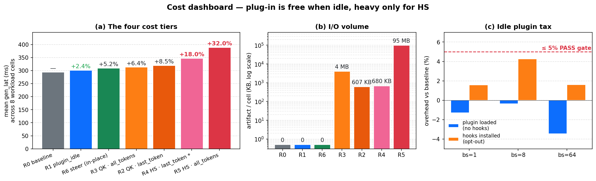
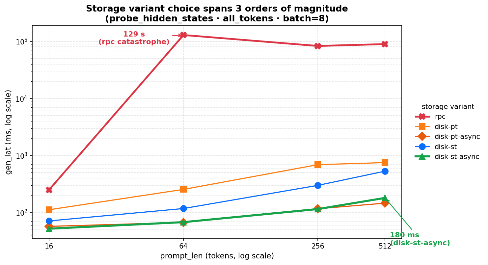
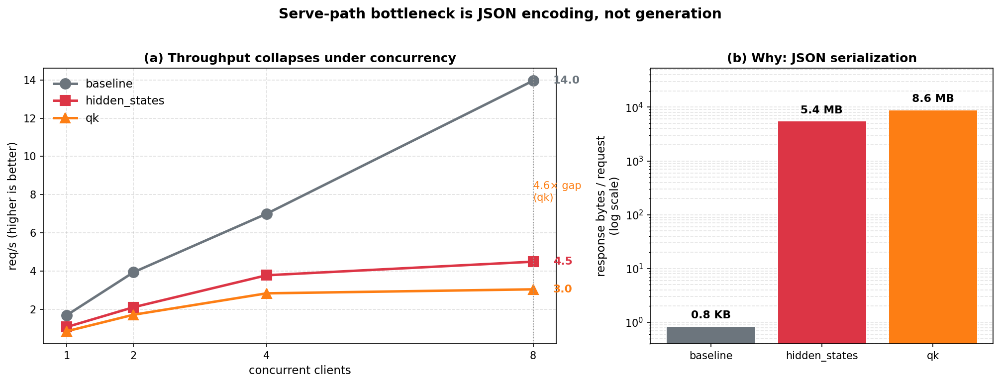

# vLLM-Hook Performance — Executive Summary

**Model**: Qwen2-1.5B-Instruct · **GPU**: A100-class · **vLLM**: 0.21.0 (eager) · **Plugin**: v0.2.0
**Date**: 2026-06-03 · **Full report**: [`REPORT.md`](REPORT.md)

---

## 1. Five findings

> **① The plug-in is free when idle.** Loading vLLM-Hook but firing no hooks costs **+2.4%** vs. stock vLLM — inside run-to-run noise on every workload cell. ✅

> **② "Heavy" is mode-dependent, not worker-dependent.** `probe_hidden_states` in `all_tokens` mode adds **+32%** because it serialises ~97 MB / request. The same worker in `last_token` mode adds **~+18%** with a flat **680 KB** artifact regardless of prompt length — the mode is a 140× artifact-size decision the user makes per request. Every other hook adds 5–8%.

> **③ Storage variant choice matters more than hook choice.** `disk-st-async` wins **14 of 16** cells. The wrong storage variant (`rpc + all_tokens`) is **~1,900× slower** at large workloads (180 ms → 129,000 ms). 🔴

> **④ Idle plug-in tax passes every CUDA-graph budget gate.** Worst measurement is **+4.27%** vs. the **≤ 5%** target. ✅

> **⑤ Serve-path throughput collapses because of JSON, not generation.** At 8 concurrent clients, baseline reaches **14 req/s** while QK reaches **3 req/s** (4.6× gap). The mechanism is response size: QK = **8.6 MB / request**, HS = **5.4 MB / request**, baseline = **0.8 KB**. Counter-intuitively, HS throughput beats QK throughput online despite costing more offline — because QK serialises more bytes. 🔴

---

## 2. The cost dashboard

Three signals on one figure:

- **(a)** Generation latency clusters into four tiers — free (R0/R1), in-place steering (R6), light probes (R2/R3 QK + R4 HS·last_token), and the heavy R5 HS·all_tokens. Numbers are mean across 8 workload cells per row. R4 is marked with `*` because its value is currently an *estimate* derived from the storage CSV's HS-last-vs-HS-all ratio; the next quick run will replace it with the measured number.
- **(b)** Artifact volume per cell, log-scale. R5 is **140× larger** than R4 and **160,000× larger** than the QK and steer rows. Most of R5's latency cost is paying to move this volume; R4 captures the *same hidden states* but only at the last token, so its artifact is flat regardless of prompt length.
- **(c)** Idle tax against the ≤ 5% gate. Every batch size passes with room to spare; the worst case (+4.27% at bs=8) is for "hooks installed but every request opts out" — the most pessimistic configuration.

---

## 3. Storage variant choice spans 3 orders of magnitude

Same worker (`probe_hidden_states`), same workload (batch=8, all_tokens), only the storage variant changes. The y-axis is log-scale. `rpc` collapses catastrophically once payloads cross a few MB — every layer's cloned activations are pickled, zstd-compressed, and round-tripped through `collective_rpc`. `disk-st-async` stays under **200 ms** at every prompt length tested.

**Recommendation**: set `VLLM_HOOK_USE_SAFETENSORS=1 VLLM_HOOK_ASYNC_SAVE=1` as the documented default in `configs.md`.

---

## 4. Serve-path throughput collapses under concurrency

- **(a)** Baseline scales linearly to **14 req/s** at k=8. Hook workers plateau early.
- **(b)** Why? Response size. Baseline responses are **0.8 KB**; QK responses are **8.6 MB**; HS responses are **5.4 MB**. Every byte gets JSON-encoded inside `_serialize_probes`, which holds the asyncio event loop. At k=8 the cumulative encode time exceeds the generation budget and throughput plateaus.

**Recommendation**: land the proposed `bytes+zstd+base64` wire-format patch from `plan.html` §7. This is the single highest-leverage open optimisation for serve-path users — it directly attacks the bottleneck this figure exposes.

---

## 5. Recommendations (priority order)

| # | Action | Evidence | Effort |
|---|---|---|---|
| 1 | **Default `disk-st-async` in `configs.md`** | Fig 2 (1,900× speedup over rpc at scale) | docs change |
| 2 | **Land `bytes+zstd+base64` wire-format patch** | Fig 3 (4.6× throughput collapse at k=8) | medium |
| 3 | **Treat R4 worst-cell (pl=256, bs=16, mt=32, all_tokens) as the regression gate** | Fig 1 (only "heavy" hook) | trivial |
| 4 | **Document the R0–R1 "free when idle" claim** in the v0 paper rewrite | Fig 1, panel (c) | docs change |

---

## 6. Threats to validity

- One model (Qwen2-1.5B); larger models may shift absolutes but not rankings.
- Eager mode (`enforce_eager=True`); CUDA-graph re-enablement is tracked separately on the `graph_enable` branch.
- v0.1.0 paired comparison is partial — only steering ran cleanly (+ ~4% v0.1.0 win); QK and HS pending a re-run after the entry-points collision fix.
- `n_layers` held fixed at all 28; `Numerical_Analysis/` swept this axis and we don't.

For the full methodology, data tables, per-stage timer breakdown, and v0.2.0-vs-v0.1.0 detail, see [`REPORT.md`](REPORT.md).
